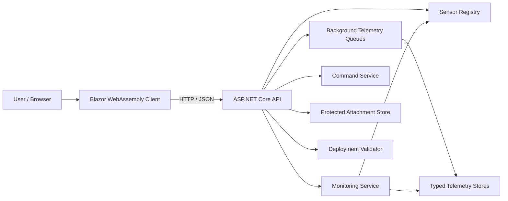

# SmartX — IoT Sensor Gateway & Monitoring Platform

SmartX is a full-stack **IoT sensor management and monitoring platform** built with **.NET 10**, **ASP.NET Core**, and **Blazor WebAssembly**.

The system simulates a smart hydroponic facility where environmental sensors, power meters, and actuators can be registered, monitored, organised into deployment structures, and controlled through a central gateway.

SmartX demonstrates typed telemetry processing, real-time monitoring, command execution, undo functionality, recursive data structures, file protection, asynchronous background processing, and REST API development.


---

## Overview

**SmartX Gateway** provides a central interface for managing connected IoT devices within a simulated hydroponic farming environment.

The platform allows users to:

* Register and manage sensors
* Submit strongly typed telemetry readings
* Monitor sensor health and warning states
* Review current and historical telemetry
* Organise sensors into nested deployment structures
* Upload encrypted sensor-related attachments
* Issue commands to connected devices
* Undo previously issued commands
* Review command execution history
* Simulate large volumes of IoT data
* Process incoming telemetry through ordered background queues

The solution is divided into three projects:

```text
SmartX.Api
SmartX.Client
SmartX.Shared
```

---

## Architecture



The **Blazor WebAssembly client** runs separately from the backend API and communicates with it through HTTP.

Shared models and request objects are stored in `SmartX.Shared`, allowing the frontend and backend to use the same strongly typed contracts.

---

# Features

## Sensor Registration

SmartX allows IoT devices to be registered through the dashboard.

Each sensor contains:

* Unique sensor ID
* Device identifier
* Deployment location
* Sensor category
* Telemetry data type
* Registration timestamp

Device identifiers are unique and are checked case-insensitively.

### Supported Sensor Categories

```text
Environmental
Power Consumption
Actuator
```

### Supported Telemetry Types

```text
Float
Integer
Boolean
```

This allows different devices to use telemetry types appropriate to their purpose.

For example:

* Soil moisture sensor → `Float`
* Power meter → `Integer`
* Valve actuator → `Boolean`

---

## Typed Telemetry Processing

SmartX uses **generic telemetry models and stores** rather than treating every sensor reading as the same data type.

```text
TelemetryPacket<float>
TelemetryPacket<int>
TelemetryPacket<bool>
```

Separate telemetry endpoints are available for each supported data type.

The API validates that the type of data being submitted matches the telemetry type assigned to the selected sensor.

This prevents, for example, a Boolean actuator from receiving a floating-point telemetry reading.

---

## Ordered Background Telemetry Queues

Incoming sensor readings can be processed using dedicated background queues for:

```text
Float telemetry
Integer telemetry
Boolean telemetry
```

The queue system processes telemetry in **FIFO order**, allowing readings to be handled asynchronously while maintaining the sequence in which they were received.

The implementation uses asynchronous coordination to allow API requests to submit readings without directly managing shared telemetry collections.

This demonstrates:

* Background processing
* FIFO queues
* Asynchronous programming
* Generic services
* Thread coordination
* Ordered telemetry processing

---

## Telemetry History

Each registered sensor maintains its own telemetry history.

Users can:

* Submit new readings
* View previous readings
* Refresh telemetry
* View UTC timestamps
* Review readings in reverse chronological order

The system stores telemetry independently according to its underlying data type.

---

## Daily Telemetry History

SmartX can group telemetry into individual UTC days.

The daily history system uses **generic jagged arrays**:

```text
TelemetryPacket<T>[][]
```

Each array represents a different day, while each day may contain a different number of telemetry readings.

This allows SmartX to represent realistic situations where sensor activity varies from day to day.

---

## Live Sensor Monitoring

The monitoring dashboard provides a central view of the current state of all registered sensors.

Sensors can appear in the following states:

```text
Normal
Warning
Stale
No data
```

Monitoring uses the most recent cached telemetry value instead of repeatedly scanning the complete reading history.

---

## Environmental Monitoring

Environmental sensors can be checked against configurable soil moisture thresholds.

A sensor can enter a warning state when its reading falls outside the configured range.

Example:

```text
Minimum moisture: 20%
Maximum moisture: 80%
```

---

## Power Monitoring

Power-consumption sensors can be checked against a configured power limit.

Example:

```text
Maximum power: 1200 W
```

Values exceeding the configured limit result in a monitoring warning.

SmartX also contains a `PowerReading` value type with overloaded operators for:

* Addition
* Greater than
* Less than
* Greater than or equal
* Less than or equal

Checked arithmetic is used to detect integer overflow when power readings are combined.

---

## Stale Sensor Detection

SmartX detects sensors that have stopped providing recent data.

When the most recent telemetry reading is older than the configured stale threshold, the sensor is displayed as:

```text
Stale
```

Sensors that have never submitted telemetry are displayed as:

```text
No data
```

---

## Automatic Monitoring Refresh

The live monitoring dashboard automatically refreshes its data at regular intervals.

This allows the interface to reflect changes in telemetry and sensor state without requiring the user to manually reload the page.

---

# Real-Time Command Stream

SmartX includes a command system for controlling registered devices.

The Command Stream interface allows commands to be issued to devices and records their execution history.

The command system demonstrates a practical approach to managing changing device state.

---

## Device Commands

Commands can be issued to supported devices through the SmartX dashboard.

Each command records information such as:

* Target sensor
* Requested device state
* Previous state
* Resulting state
* Execution information

Commands are handled through a dedicated backend service rather than directly inside the API endpoint.

---

## Command History

Previously executed device commands are retained in command history.

The dashboard allows users to review the sequence of device changes that have been issued through the gateway.

This provides visibility into previous device activity and state changes.

---

## Undo Support

SmartX supports undoing the most recent applicable command.

A stack-based approach is used to track previous device state, allowing the latest command to be reversed.

Conceptually:

```text
Command 1
Command 2
Command 3
   ↓
Undo
   ↓
Command 3 reversed
```

This demonstrates practical use of a **Stack** data structure within an application workflow.

---

# Deployment Validation

Sensors can be organised within nested deployment structures.

For example:

```text
Facility
└── Greenhouse
    └── Zone
        └── Section
            └── Sensor
```

SmartX recursively validates the proposed deployment tree.

---

## Deployment Rules

The validator checks that:

* Deployment nodes have valid names
* Registered sensors actually exist
* A sensor does not appear multiple times
* Disabled parent nodes cannot contain effectively enabled sensors
* Sensor nodes cannot contain child nodes
* Grouping nodes contain children
* Repeated node references are detected
* Excessively deep structures are rejected
* Excessively large deployment trees are rejected

The validator supports:

```text
Maximum tree depth: 64 levels
Maximum nodes: 10,000
```

The dashboard can build and validate nested deployment paths before they are accepted.

---

# Sensor Attachments

Files can be attached to individual sensors.

This can be used for:

* Configuration files
* Sensor logs
* Images
* Reports
* Device documentation

Supported formats include:

```text
JSON
XML
YAML
YML
TXT
CSV
LOG
JPG
JPEG
PNG
PDF
```

Maximum attachment size:

```text
5 MiB
```

Users can:

* Upload attachments
* View sensor attachments
* Download attachments

---

## Protected File Storage

Sensor attachment contents are protected using **ASP.NET Core Data Protection**.

Protection is associated with both:

```text
Sensor ID
Attachment ID
```

The correct sensor and attachment identifiers are therefore required when retrieving and decrypting a stored file.

Uploaded filenames are also sanitised before being stored.

---

# Demo Data Simulation

SmartX contains a development data generator for testing the system with a much larger workload.

The demo data service generates:

```text
1,000 sensors
7 days of telemetry per sensor
20–30 readings per day
```

Sensors are distributed between:

```text
Environmental sensors
Power-consumption sensors
Actuators
```

The generator creates deterministic test data using a fixed random seed while still generating unique sensor identifiers for each run.

The number of generated readings and the time required to generate them are also reported.

---

# Sensor Directory

The sensor directory provides a central view of registered devices.

The interface supports features including:

* Sensor listing
* Search
* Category filtering
* Client-side pagination
* Telemetry navigation
* Attachment navigation
* Refresh controls

This makes it easier to work with larger simulated sensor environments.

---

# REST API

The backend uses ASP.NET Core Minimal APIs.

## System

| Method | Endpoint               | Description                          |
| ------ | ---------------------- | ------------------------------------ |
| `GET`  | `/api/health`          | Check API health                     |
| `GET`  | `/api/power/aggregate` | Combine and compare power readings   |
| `GET`  | `/api/monitoring`      | Retrieve current monitoring snapshot |

## Sensors

| Method | Endpoint            | Description                 |
| ------ | ------------------- | --------------------------- |
| `GET`  | `/api/sensors`      | Retrieve registered sensors |
| `GET`  | `/api/sensors/{id}` | Retrieve a specific sensor  |
| `POST` | `/api/sensors`      | Register a new sensor       |

## Telemetry

| Method | Endpoint                                    | Description                    |
| ------ | ------------------------------------------- | ------------------------------ |
| `POST` | `/api/sensors/{id}/telemetry/float`         | Submit float telemetry         |
| `GET`  | `/api/sensors/{id}/telemetry/float`         | Retrieve float history         |
| `GET`  | `/api/sensors/{id}/telemetry/float/daily`   | Retrieve daily float history   |
| `POST` | `/api/sensors/{id}/telemetry/integer`       | Submit integer telemetry       |
| `GET`  | `/api/sensors/{id}/telemetry/integer`       | Retrieve integer history       |
| `GET`  | `/api/sensors/{id}/telemetry/integer/daily` | Retrieve daily integer history |
| `POST` | `/api/sensors/{id}/telemetry/boolean`       | Submit Boolean telemetry       |
| `GET`  | `/api/sensors/{id}/telemetry/boolean`       | Retrieve Boolean history       |
| `GET`  | `/api/sensors/{id}/telemetry/boolean/daily` | Retrieve daily Boolean history |

## Attachments

| Method | Endpoint                                       | Description                 |
| ------ | ---------------------------------------------- | --------------------------- |
| `GET`  | `/api/sensors/{id}/attachments`                | Retrieve sensor attachments |
| `POST` | `/api/sensors/{id}/attachments`                | Upload an attachment        |
| `GET`  | `/api/sensors/{id}/attachments/{attachmentId}` | Download an attachment      |

## Deployments

| Method | Endpoint                    | Description                |
| ------ | --------------------------- | -------------------------- |
| `POST` | `/api/deployments/validate` | Validate a deployment tree |

## Commands

| Method | Endpoint                   | Description                        |
| ------ | -------------------------- | ---------------------------------- |
| `POST` | `/api/commands`            | Issue a device command             |
| `GET`  | `/api/commands/{sensorId}` | Retrieve command history           |
| `POST` | `/api/commands/undo`       | Undo the latest applicable command |

## Development

| Method | Endpoint         | Description                              |
| ------ | ---------------- | ---------------------------------------- |
| `POST` | `/api/demo/seed` | Generate simulated sensors and telemetry |

The demo seed endpoint is only exposed while the API is running in the **Development** environment.

---

# Technologies

## Backend

* C#
* .NET 10
* ASP.NET Core
* Minimal APIs
* ASP.NET Core Data Protection
* Dependency Injection
* Generic Services
* Background Services
* OpenAPI

## Frontend

* Blazor WebAssembly
* Razor Components
* Bootstrap
* HTML
* CSS
* C#

## Architecture & Programming Concepts

* REST API architecture
* Generic programming
* Asynchronous programming
* Dependency injection
* Recursive algorithms
* Tree structures
* Stack-based undo
* FIFO queues
* Jagged arrays
* Operator overloading
* Thread-safe shared state
* Background processing
* Data validation
* File protection

---

# Project Structure

```text
SmartX/
│
├── SmartX.Api/
│   │
│   ├── Endpoints/
│   │   ├── SensorEndpoints.cs
│   │   ├── TelemetryEndpoints.cs
│   │   ├── SensorAttachmentEndpoints.cs
│   │   ├── DeploymentEndpoints.cs
│   │   ├── DemoEndpoints.cs
│   │   └── CommandEndpoints.cs
│   │
│   ├── Services/
│   │   ├── SensorRegistry.cs
│   │   ├── TelemetryStore.cs
│   │   ├── TelemetryQueue.cs
│   │   ├── MonitoringService.cs
│   │   ├── SensorAttachmentStore.cs
│   │   ├── DeploymentValidator.cs
│   │   ├── DemoDataSeeder.cs
│   │   └── CommandService.cs
│   │
│   ├── Program.cs
│   └── appsettings.json
│
├── SmartX.Client/
│   │
│   ├── Layout/
│   │   ├── MainLayout.razor
│   │   └── NavMenu.razor
│   │
│   ├── Pages/
│   │   ├── Home.razor
│   │   ├── Sensors.razor
│   │   ├── Telemetry.razor
│   │   ├── DailyHistory.razor
│   │   ├── Attachments.razor
│   │   ├── Monitoring.razor
│   │   ├── Deployments.razor
│   │   └── Commands.razor
│   │
│   ├── wwwroot/
│   └── Program.cs
│
├── SmartX.Shared/
│   │
│   ├── Models/
│   ├── Requests/
│   └── SmartX.Shared.csproj
│
└── SmartX.slnx
```

---

# Data Flow

A typical telemetry request follows this flow:

```text
Sensor
   ↓
REST API
   ↓
Typed Telemetry Queue
   ↓
Background Processing
   ↓
TelemetryStore<T>
   ↓
Monitoring Service
   ↓
Blazor Dashboard
```

This keeps responsibilities separated and allows incoming telemetry to be processed in order.

---

# Getting Started

## Prerequisites

Install:

* [.NET 10 SDK](https://dotnet.microsoft.com/download)
* Visual Studio 2022 / Visual Studio 2026 or another .NET-compatible IDE
* A modern web browser

---

## Clone the Repository

```bash
git clone https://github.com/Sujendran-Reddy/SmartX.git
cd SmartX
```

---

## Restore Dependencies

```bash
dotnet restore
```

---

# Running the Application

SmartX consists of a separate API and Blazor WebAssembly frontend.

Both projects should be running at the same time.

## 1. Start the API

```bash
dotnet run --project SmartX.Api --launch-profile https
```

The development API runs at:

```text
https://localhost:7101
```

---

## 2. Start the Blazor Client

Open a second terminal:

```bash
dotnet run --project SmartX.Client --launch-profile https
```

The client runs at:

```text
https://localhost:7102
```

Open the client URL in your browser.

The SmartX home page will automatically check whether the backend gateway is reachable.

---

# OpenAPI

OpenAPI support is enabled while running in the Development environment.

The API specification can be accessed from the backend development server.

This can be used with API development tools to inspect and test the available SmartX endpoints.

---

# Configuration

The Blazor client stores the API address in:

```text
SmartX.Client/wwwroot/appsettings.json
```

Example:

```json
{
  "ApiBaseUrl": "https://localhost:7101/"
}
```

The API also supports configurable monitoring thresholds.

Example configuration values include:

```text
Monitoring:MinimumMoisturePercent
Monitoring:MaximumMoisturePercent
Monitoring:MaximumPowerWatts
Monitoring:StaleAfterSeconds
```

---

# Validation & Reliability

SmartX includes validation at multiple levels.

### Sensor Registration

* Required device identifier
* Maximum identifier length
* Required deployment location
* Maximum location length
* Valid sensor category
* Valid telemetry data type
* Duplicate device protection

### Telemetry

* Sensor must exist
* Telemetry type must match sensor configuration
* Telemetry value must be provided
* Floating-point values must be finite

### Attachments

* Sensor must exist
* Empty files are rejected
* Maximum size of 5 MiB
* Restricted file extensions
* Sanitised filenames
* Protected attachment contents

### Deployment Trees

* Registered sensor verification
* Duplicate assignment detection
* Maximum depth protection
* Maximum node protection
* Parent/child state validation
* Group and sensor-node validation

---

# Thread Safety

Backend stores are registered as singleton services because data needs to remain available across API requests during the running application session.

Shared collections use synchronisation when being accessed or modified.

Examples include:

* Sensor registration
* Telemetry storage
* Attachment storage
* Command state
* Command history

This prevents concurrent requests from corrupting shared in-memory collections.

---

# Current Persistence Model

SmartX currently uses **in-memory storage** for its simulated gateway data.

This includes:

* Sensors
* Telemetry
* Attachments
* Commands
* Command history

Data remains available while the API process is running but resets when the API is restarted.

This design keeps the project focused on gateway behaviour, algorithms, data structures, API design, and IoT processing rather than database infrastructure.

---

# Concepts Demonstrated

SmartX demonstrates practical implementation of several important software-development concepts:

* Full-stack .NET development
* Blazor WebAssembly
* ASP.NET Core REST APIs
* Strongly typed client/server contracts
* Generic classes
* Generic telemetry processing
* Dependency injection
* Asynchronous API calls
* Background processing
* FIFO queues
* Stack-based undo functionality
* Recursive tree traversal
* Nested data structures
* Jagged arrays
* Operator overloading
* Thread-safe collections
* File uploads and downloads
* ASP.NET Core Data Protection
* Input validation
* CORS
* OpenAPI
* Monitoring dashboards
* Simulation and test-data generation

---

# Future Development

SmartX is structured to support further expansion of the gateway, including:

* Network topology visualisation
* Mesh routing
* Persistent database storage
* Device authentication
* Real IoT hardware communication
* Historical analytics and visualisation
* Expanded automation rules
* Additional command types

---

# Author

**Sujendran Reddy**

SmartX was developed as a full-stack .NET project demonstrating IoT gateway development, sensor telemetry processing, recursive data structures, background processing, device command management, real-time monitoring, and modern ASP.NET Core development.
